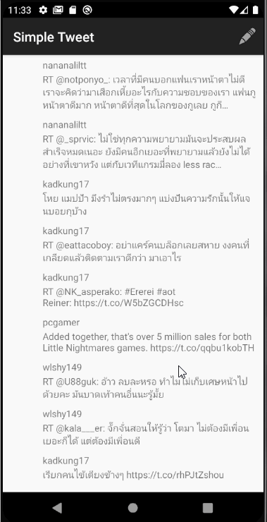
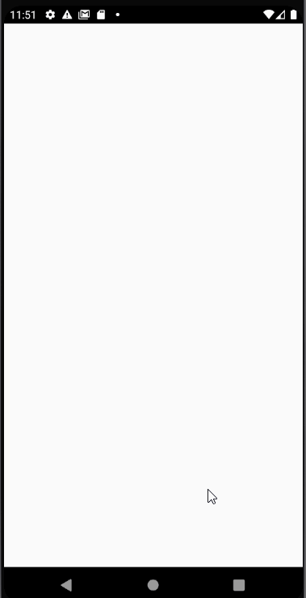

# Project 2 - *Simple Tweet*

**Simple Tweet** is an android app that allows a user to view his Twitter timeline. The app utilizes [Twitter REST API](https://dev.twitter.com/rest/public).

## Part II

Time spent: **4** hours spent in total

## User Stories

The following **required** functionality is completed:

- [x] User can **compose and post a new tweet**
  - [x] User can click a “Compose” icon in the Action Bar on the top right
  - [x] User can then enter a new tweet and post this to twitter
  - [x] User is taken back to home timeline with **new tweet visible** in timeline
  - [x] Newly created tweet should be manually inserted into the timeline and not rely on a full refresh
  - [x] User can **see a counter with total number of characters left for tweet** on compose tweet page

The following **optional** features are implemented:

- [ ] User is using **"Twitter branded" colors and styles**
- [ ] User can click links in tweets launch the web browser
- [ ] User can **select "reply" from detail view to respond to a tweet**
- [ ] The "Compose" action is moved to a FloatingActionButton instead of on the AppBar
- [ ] Compose tweet functionality is build using modal overlay
- [x] Use Parcelable instead of Serializable using the popular [Parceler library](http://guides.codepath.org/android/Using-Parceler).
- [ ] User can **open the twitter app offline and see last loaded tweets**. Persisted in SQLite tweets are refreshed on every application launch. While "live data" is displayed when app can get it from Twitter API, it is also saved for use in offline mode.
- [ ] When a user leaves the compose view without publishing and there is existing text, prompt to save or delete the draft. If saved, the draft should then be **persisted to disk** and can later be resumed from the compose view.
- [ ] Enable your app to receive implicit intents from other apps. When a link is shared from a web browser, it should pre-fill the text and title of the web page when composing a tweet.

The following **additional** features are implemented:

- [ ] List anything else that you can get done to improve the app functionality!

## Video Walkthrough

Here's a walkthrough of implemented user stories:

GIF created with [LiceCap](http://www.cockos.com/licecap/).

## Notes

Main challenge I had this time is figuring out how to get the TextInputLayout to work as the Android Studio had shown me an error, but it gave no suggestions as to what I can do. 

## Part I

Time spent: **4** hours spent in total

## User Stories

The following **required** functionality is completed:

- [x] User can **sign in to Twitter** using OAuth login
- [x]	User can **view tweets from their home timeline**
  - [x] User is displayed the username, name, and body for each tweet
  - [x] User is displayed the [relative timestamp](https://gist.github.com/nesquena/f786232f5ef72f6e10a7) for each tweet "8m", "7h"
- [x] User can refresh tweets timeline by pulling down to refresh

The following **optional** features are implemented:

- [ ] User can view more tweets as they scroll with infinite pagination
- [ ] Improve the user interface and theme the app to feel "twitter branded"
- [ ] Links in tweets are clickable and will launch the web browser
- [ ] User can tap a tweet to display a "detailed" view of that tweet
- [ ] User can see embedded image media within the tweet detail view
- [ ] User can watch embedded video within the tweet
- [ ] User can open the twitter app offline and see last loaded tweets
- [ ] On the Twitter timeline, leverage the CoordinatorLayout to apply scrolling behavior that hides / shows the toolbar.

The following **additional** features are implemented:

- [ ] List anything else that you can get done to improve the app functionality!

## Video Walkthrough

Here's a walkthrough of implemented user stories:

GIF created with [LiceCap](http://www.cockos.com/licecap/).

## Notes

There seems to be an ADB bridge issue or some issue of that sort which failed my application multiple times when I was trying to start it. Reading through all the APIs and actually trying to learn more about what the API can be used for is also challenging in the aspects that there can be multiple possibilities of what data I could call if I were to work on my own.

## Open-source libraries used

- [Android Async HTTP](https://github.com/codepath/CPAsyncHttpClient) - Simple asynchronous HTTP requests with JSON parsing
- [Glide](https://github.com/bumptech/glide) - Image loading and caching library for Android

## License

    Copyright [2021] [Nathachanok Netmaneesuk]

    Licensed under the Apache License, Version 2.0 (the "License");
    you may not use this file except in compliance with the License.
    You may obtain a copy of the License at

        http://www.apache.org/licenses/LICENSE-2.0

    Unless required by applicable law or agreed to in writing, software
    distributed under the License is distributed on an "AS IS" BASIS,
    WITHOUT WARRANTIES OR CONDITIONS OF ANY KIND, either express or implied.
    See the License for the specific language governing permissions and
    limitations under the License.
